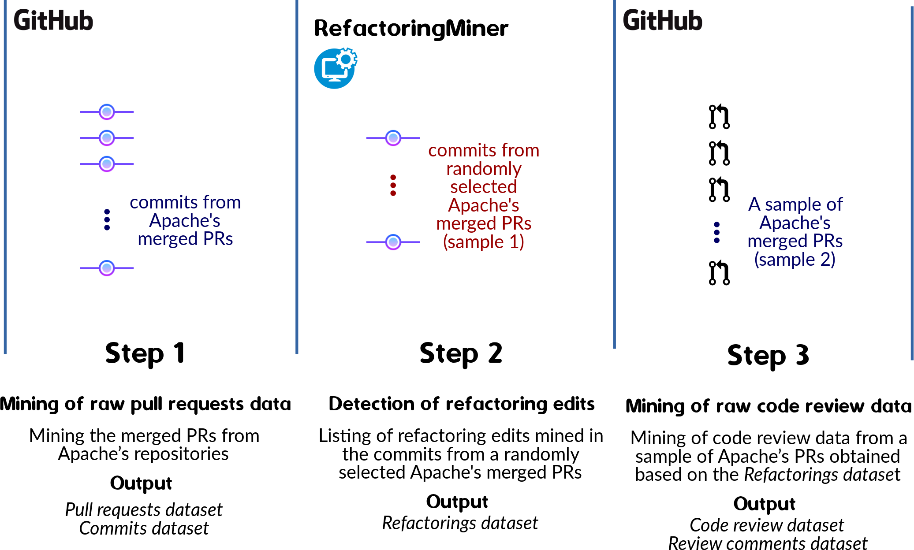
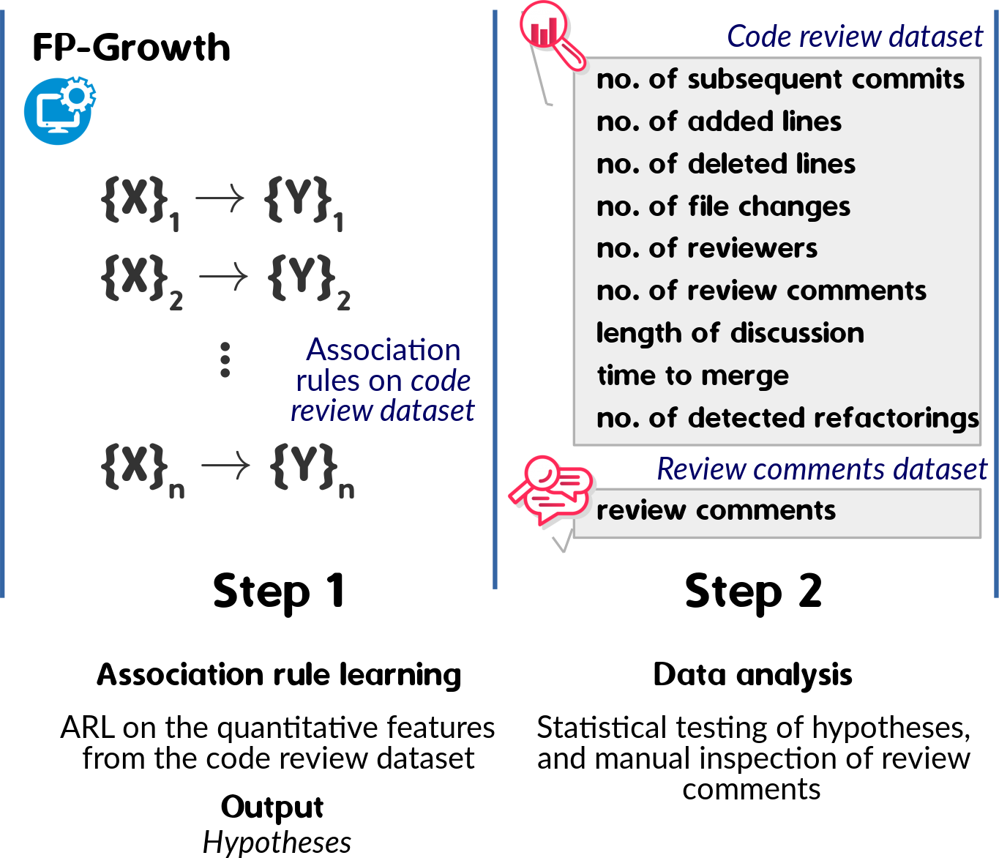
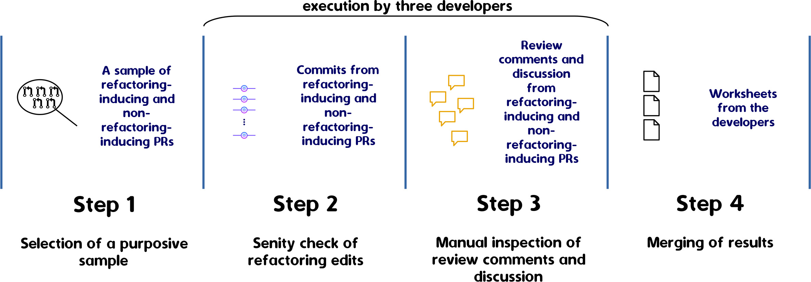

# Characterizing Refactoring-Inducing Pull Requests

*This thesis has supervised by Prof. [Tiago Massoni](https://github.com/tiagomassoni) and Prof. Everton Alves (Federal University of Campina Grande, Brazil) in collaboration with Prof. [Nikolaos Tsantalis](https://github.com/tsantalis) (Concordia University, Canada) *

## Reproduction kit

Following, we provide the instructions for reproducing our empirical study on [Apache](https://github.com/apache)'s Java repositories in line with the research questions and design below.
You can also go along the links to get access to our data and results!

---
  * [Mining of refactoring edits and code review data](#Mining-of-Refactoring-Edits-and-Code-Review-Data) 
  * [Comparing refactoring-inducing and non-refactoring-inducing pull requests](#Comparing-Refactoring-Inducing-and-non-Refactoring-Inducing-Pull-Requests)
  * [Characterizing code review in refactoring-inducing pull requests](#Characterizing-Code-Review-in-Refactoring-Inducing-Pull-Requests)
  * [Characterizing refactoring edits in refactoring-inducing pull requests](#Characterizing-Refactoring-Edits-in-Refactoring-Inducing-Pull-Requests)

---

### *Mining of Refactoring Edits and Code Review Data*

#### Step 1. Mining of raw pull requests data
1. Search for Apache's non-archived Java repositories in [GitHub](https://github.com/search), by inputting *"user:apache language:java archived:false"* `We performed this search in August 2019`
1. Run the Python script [githubMinerPygithub](Step1/githubMinerPygithub.py)

The recovery of squashed commits from GitHub was built in lines 33-45, 126-130, 163-164. Aiming the strategy's effectiveness, we followed a few open pull requests up to the merge, such as the [apache/drill's pull request 1807](https://github.com/apache/drill/pull/1807), then we (1) ran the RefactoringMiner to detect refactorings in the commits from open pull requests; (2) executed the recovery strategy after the pull requests merge; (3) ran the RefactoringMiner in the recovered commits; and (4) compared the outputs from steps (1) and (3)
   * No input
   * Output:
      * [./data/](data-mining-design/step-1/data) maintains repositories to pre-processing (needed to recover squashed and merged pull requests)
      * [./process/](data-mining-design/step-1/process) stores the *commits dataset* and *pull requests dataset* - both structured in line with the input format required to run the refactoring detection, so containing records for the following variables:
         * (commits dataset) repository's URL, pull request number, and commit SHA; for example, (*https://www.github.com/apache/dubbo-admin.git, 481,  77579afb66e1a78eb491f0a783705d40484de5a7*); and
         * (pull requests dataset) repository's URL, and pull request number; for example, (*https://www.github.com/apache/dubbo-admin.git, 479*)
      * [./results/](data-mining-design/step-1/results) registers the number of merged pull requests by repository

#### Step 2. Detection of refactoring edits
* Run the [Java code](data-mining-design/step-2/Main.java) for triggering the [RefactoringMiner](https://github.com/tsantalis/RefactoringMiner) tool.
`Warning: This is a time-consuming task. If you have any problem, you should manually rerun the trigger and manage the output datasets.`
   * Input was preset as *commits dataset* and *pull requests dataset* (Step 1) - both available in [./data/](data-mining-design/step-2/data))
   * Output:
      * [./results/](data-mining-design/step-2/results) stores the following datasets:
         * [output_refactorings_at_apache_commits_level.csv](data-mining-design/step-2/results/output_refactorings_at_apache_commits_level.zip)
         * [output_refactorings_at_apache_prs_level.csv](data-mining-design/step-2/results/output_refactorings_at_apache_prs_level.zip)
      * The output datasets comprise these variables: repository's name, pull request number, commit(s) SHA, refactoring type(s), refactoring detail(s), and level; for example, (*apache/flink, 9595, 886419f12f60df803c9d757e381f201920a8061a, Rename Variable, table:Table to src:Table in method public testPartitionPrunning():void in class org.apache.flink.connectors.hive.HiveTableSourceTest, commit*). Level is a flag indicating the RefactoringMiner running level, that is, either commit level for squashed and merged pull requests or pull request level for non-squashed and merged pull requests.
   * Utils:
      * A Python script ([filesConcat](data-mining-design/step-2/filesConcat.py)) for concatenating the output datasets, resulting in *detected refactorings dataset* - [output_refactorings_at_apache.csv](data-mining-design/step-2/results/output_refactorings_at_apache.zip)

#### Step 3. Mining of raw code review data 
* Run the Python script [githubReviewMinerPygithub](data-mining-design/step-3/githubReviewMinerPygithub.py) for mining the code reviewing-related attributes listed below.

| Attribute            | Description                                     |
|----------------------|-------------------------------------------------|
| number               | Numerical identifier of a pull request          |
| title                | Title of a pull request                         |
| repository           | Repository's name of a pull request             |
| labels               | Labels associated with a pull request           |
| commits              | Number of subsequent commits in a pull request  |
| additions            | Number of added lines in a pull request         |
| deletions            | Number of deleted lines in a pull request       |
| file changes         | Number of file changes in a pull request        |
| creation date        | Date and time of a pull request creation        |
| merge date           | Date and time of a pull request merge           |
| reviewers            | Number of reviewers in a pull request           |
| review comments      | Number of review comments in a pull request     |
| non-review comments  | Number of non-review comments in a pull request |
| review comments text | The review comments of a pull request           |

`Specifically, our implementation meets this precondition: we mine only merged pull requests, comprising at least one review comment, since we investigated code reviewing-related aspects in the context of refactoring-inducing pull requests.`

   * Input was preset as *detected refactorings dataset* (Step 2) - available in [./data/](data-mining-design/step-3/data)) 
   * Output:
      * *Code review dataset* - [output_reviewing_apache.csv](data-mining-design/step-3/manual-inspection-of-rebasing/output/output_reviewing_apache.csv)
      * *Code review comments dataset* - [refactorings_at_apache_output_review_comments.csv](data-mining-design/step-3/results/refactorings_at_apache_output_review_comments.zip)
   * Utils:
      * A Python script ([datasetsOrganizer](data-mining-design/step-3/datasetsOrganizer.py)) for cleaning the output datasets (checking for mirrored repositories, duplicates, and unexpected faults such as zero reviewers), resulting in [output_apache_refactorings_review.csv](data-mining-design/step-3/results/output_apache_refactorings_review.csv) and [output_apache_refactorings_review_comments.csv](data-mining-design/step-3/results/output_apache_refactorings_review_comments.zip). 
      * A Python script ([githubMinerAuthoredData](data-mining-design/step-3/githubMinerAuthoredData.py)) for marking the initial commits in the complete refactorings dataset, resulting in [output_final_refactorings_at_apache.csv](data-mining-design/step-3/results/output_final_refactorings_at_apache.zip)
      * A Python script ([githubMinerCommitsData](data-mining-design/step-3/githubMinerCommitsData.py)) for mining the number of file changes, line additions, and line deletions in subsequent commits of our sample, resulting in an updated *code review dataset* [output_reviewing_at_apache.csv](data-mining-design/step-3/output/output_reviewing_at_apache.csv)
      * A Python script ([githubMinerParentsData](data-mining-design/step-3/githubMinerParentsData.py)) for mining the number of parents in subsequent commits of our sample, resulting in an updated *code review dataset* [output_reviewing_at_apache.csv](data-mining-design/step-3/output/output_reviewing_at_apache.csv)
      * A Python script ([githubMinerCheckingRebase](data-mining-design/step-3/githubMinerCheckingRebase.py)) for searching for commit merge in subsequents commits of our sample, resulting in an updated *code review dataset* [output_reviewing_at_apache.csv](data-mining-design/step-3/output/output_reviewing_at_apache.csv)
      
`After, we performed a manual inspection of pull requests searching for rebasing. Accordingly, the code review dataset consists of pull requests that did not suffer rebase, merged by either merge pull request or squash and merge option.`

---

### *Comparing Refactoring-Inducing and non-Refactoring-Inducing Pull Requests*

#### *Research questions*
* RQ1 How common are refactoring-inducing pull requests?
* RQ2 How do refactoring-inducing pull requests compare to non-refactoring-inducing ones?
* RQ3 Are refactoring edits induced by code reviews?

#### Step 1. Association rule learning
* Run the Python script [pre-arl](study-one/step-1/pre-ARL/pre_arl.py) for preparing data for ARL running.
  * Input was preset as *code review dataset* (Mining of refactoring edis and code review data, Step 3) - available in [./pre-ARL/input](study-one/step-1/pre-ARL/input)
  * Output: 
      * updated *Code review dataset* - [output_pre_arl_at_apache.csv](study-one/step-1/pre-ARL/output/output_pre_arl_at_apache.csv)
  
* Run the Python script [arl](study-one/step-1/arl.py) for running the FP-growth algorithm on the following code reviewing-related features.

| Feature                                                                          |
|----------------------------------------------------------------------------------|
| number of subsequent commits                                                     |
| number of file changes                                                           |
| number of added lines                                                            |
| number of deleted lines                                                          |
| number of reviewers                                                              |
| number of review comments                                                        |
| length of discussion = number of review comments + number of non-review comments |
| time to merge = merge date - creation date                                       |
| number of detected refactorings                                                  |

We applied one-hot encoding for binning of features, as described below.

| Category   | Range                       |
|------------|-----------------------------|
| None       | 0                           |
| Low        | 0 < quantile  &lt;= 0.25    |
| Medium     | 0.25 < quantile  &lt;= 0.50 |
| High       | 0.50 < quantile  &lt;= 0.75 |
| Very high  | 0.75 < quantile  &lt;= 1.0  |
      
   * Input was preset as *code review dataset* (Step 1 - pre-ARL) - available in [./input/](study-one/step-1/input)
   * Output:
      * Association rules [output_ARL_at_apache.txt](study-one/step-1/output/output_ARL_at_apache.txt)
      * *Code review dataset* [output_ARL_at_apache.csv](study-one/step-1/output/output_ARL_at_apache.csv)

#### Step 2. Data analysis
* (Quantitative analysis) Run the Python script [statistical_tests](study-one/step-2/quantitative-analysis/statistical_tests.py) for running these statistical tests: checking for data normality through Shapiro-Wilk test; checking for homogeneity of variances via Levene's test; computation of confidence interval for the difference in mean or median, based on the output from previous phases; and performing of non-parametric Mann Whitney U test and *Common-Language Effect Size* (CLES)

   * Input was preset as *code review dataset* (Step 1) - available in [./input/](study-one/step-2/quantitative-analysis/input)
   * No output (the results are displayed on the console)
   
* (Quantitative analysis) Utils:
  * Python scripts ([summary](study-one/step-2/quantitative-analysis/utils/summary.py)) and ([eda](study-one/step-2/quantitative-analysis/utils/eda.py)) for summarizing the output dataset
  
* (Qualitative analysis) Run the Python script [pre-qualitative-analysis](study-one/step-2/qualitative-analysis/pre-qualitative-analysis/pre-qualitative-analysis.py) for preparing data for qualitative analysis, by manual exploration of review comments.
  * Input was preset as *code review dataset* (Step 1) - available in [./input](study-one/step-2/qualitative-analysis/pre-qualitative-analysis/input)
  * Output: 
      * a subset of merged PRs from our sample - [spreadsheet.csv](study-one/step-2/qualitative-analysis/pre-qualitative-analysis/output/output_spreadsheet.csv)
      
* (Qualitative analysis) Utils:
  * Python script ([summary-qualitative](study-one/step-2/qualitative-analysis/summary_qualitative.py)) for summarizing the qualitative analysis

---

### *Characterizing Code Review in Refactoring-Inducing Pull Requests*

#### *Research questions*
* RQ1 How are review comments characterized in refactoring-inducing and non-refactoring-inducing pull requests? 
* RQ2 What are the differences between refactoring-inducing and non-refactoringinducing pull requests, in terms of review comments? 
* RQ3 How do reviewers suggest refactorings in review comments in refactoringinducing pull requests? 
* RQ4 Do suggestions of refactoring justify the reasons? 
* RQ5 What is the relationship between suggestions of refactoring and actual
refactorings in refactoring-inducing pull requests? 

#### Purposive sampling
* Run the Python script [pre-qualitative-analysis](study-two/pre-qualitative-analysis.py) for selecting a purposive data for each round of analysis
  * Input was preset as *refactoring dataset* (Mining of refactoring edis and code review data, Step 2) - available in [./input](study-two/input)
  * Output: 
      * A worksheet for each round [sample-number/sample_number-of-round_spreadsheet.csv](study-two/output/)

The worksheets has the following fields.
 
| Field                      | Description                                                            |
|----------------------------|------------------------------------------------------------------------|
| repo                       | Repository name                                                        |
| pr_number                  | Pull request number                                                    |
| category                   | Refactoring-inducing PR or non-refactoring-inducing PR                 |
| pr_url                     | Pull request URL                                                       |
| commit                     | Commit SHA                                                             |
| initial_flag               | If a commit is initial or subsequent commit                            |
| refactoring_type           | Type of a refactoring edit                                             |
| refactoring_detail         | Description of a refactoring edit                                      |
| confirmed_refactoring_flag | If a refactoring is a true positive                                    |
| covered_refactoring_flag   | If a refactoring edit was induced by code review                       |
| floss_refactoring_flag     | If there is the presence of floss refactoring in a commit              |
| direct_review_comment_flag | If a review comment directly suggest a refactoring edit                |
| discussion_flag            | If there a discussion is related to a review comment in a commit       |
| rationale_flag             | If a review comment presents a rationale to suggest a refactoring edit |
| notes                      | Specific comments of a researcher                                      |
    
#### Data analysis
* Subjective judgment in line with the worksheet of each round  
  * Output: 
      * Merging worksheet for each round [sample-number/final_number-of-round_spreadsheet.csv](study-two/output/)
      * Comments from 3 analysts in each round [sample-number/number-of-round_comments.pdf](study-two/output/)

* Utils:
  * Python script ([summary-qualitative](study-two/summary_qualitative.py)) for summarizing the rounds of the qualitative analysis
